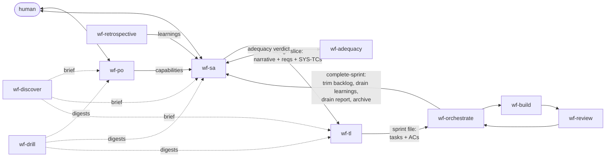

# wf target shape — the design/plan/drain layer, simplified (2026-07-25)

A sketch of wf's planning layer as agreed in discussion 2026-07-25. It **extends**
`spec-layer-redesign-20260724.md` (D1/D3/D4/D5 stand) and **completes** its D2: the
REQ tag does not become id-only — it is removed from code entirely. Requirements
become a pure planning tool with a slice-to-ship lifetime.

Three findings drive this shape:

1. **The bigger picture is lost between roles because no artifact carries it.** The
   SA's richest output — the prose walk of the design (shape, forces, end-to-end
   flow) — is spoken to the human at alignment and discarded. The slice hands the
   TL a bag of atomized EARS statements; the TL hands the build a bag of atomized
   ACs. Every "shipped but unwired" failure traces to this: the intended
   architecture was never written where a builder reads. Every prior fix
   (delivery-path allocation, the SYS-TC lane, wf-adequacy) gates the *symptom*;
   none restores the intent.
2. **The drain was an LLM-executed transaction reconstructing what the pipeline
   already knew.** wf-sa Phase 1's six ordered steps ("collect before trim or it is
   unrecoverable") exist to reverse-engineer "what shipped since my last run" from
   tags in the test tree — information `complete-sprint` held with certainty at
   close and threw away. Mechanical-over-LLM condemns this.
3. **The REQ tag was the weakest proof in the system and permanent litter.** A tag
   proves a test *mentions* an id; a merge proves the task's tests ran green
   through the gate. The tag machinery also only exists in repos wf itself built —
   the legacy-first case (wf's core promise) never had it, and already runs on
   tests + drills.

## 1. Field scan — what we steal, what stays our edge

| Framework | What it has | What we do |
|---|---|---|
| **Kiro** | Three-file spec: `requirements.md` (EARS) / `design.md` / `tasks.md`; steering files | **Steal the shape.** The design-slice becomes the spec bundle: requirements + **design narrative** + (TL's) tasks. EARS validated — keep it. Steering ≈ AGENTS.md — already have. |
| **Spec Kit** | `spec.md` → `plan.md` → `tasks.md`; constitution; clarify step | Same theft: the `plan.md` altitude is our missing narrative. Constitution ≈ ADRs + AGENTS.md. Clarify ≈ SA Phase 4 — already have, keep interactive. |
| **OpenSpec** | Changes as first-class delta docs, archived on completion | Validates our backlog/archive lifecycle. Nothing to take. |
| **Tessl / living-spec camp** | Spec as durable source of truth, code derived | **Reject.** Durable spec layers rot (dems: ~90% orphaned statements). Our durable layer is smaller and self-proving: SYS-TC descriptions live *in* the tests they describe. |

**The edge we keep and sharpen** — none of the above has any of these:

- **Drill** — scoped, cached, read-only repo scouting. Legacy-first grounding; every
  framework above is greenfield-biased.
- **Adequacy** — adversarial, source-grounded proof-of-capability. No SDD tool has a
  proof concept at all; they trust their own decomposition, which is exactly the
  circularity that produced four false drains in dems.
- **Capabilities as an open work-set** — demand drains on proof and the file trends
  to empty. Every other framework's spec directory only accumulates.
- **Mechanical gates** — slice check, sprint check, materializer, impact tool.
  Scripts verify; the LLM only judges.

The one genuine theft: **a design narrative layer between requirements and tasks.**

## 2. The artifact set

Three tiers, plus the archive.

### Durable (committed, live indefinitely)

| Artifact | Owner | Lifecycle |
|---|---|---|
| **Capabilities** | wf-po appends · wf-sa drains | Born at init (empty). PO appends user-voice demand. Drains **only on proof**: covering SYS-TCs shipped (mechanical) + adequacy verdict `adequate` (judgment). `inadequate` → residuals appended to `notes`, capability stays. Snapshot to archive on drain. |
| **ADRs** | wf-sa | Appended when a decision passes the three-condition threshold. Superseded explicitly, never deleted. The durable *how-shaped*. |
| **AGENTS.md hierarchy** | any role, co-located | Commands, gotchas, conventions. Industry-standard; grows with the repo. |
| **SYS-TC tags + descriptions in tests** | wf-build stamps | `[SYS-TC:id] <scenario description>` — the durable proof-of-capability record. A test's description describes the test, so it cannot rot apart from it. The **only** spec tag that exists in code. |
| **Tooling** (`.wf/config.yaml`, scripts) | wf-init / maintainer | Id high-water marks live here: `id_counters.cap/req/sys_tc`. |

### Working state (committed, drains to empty)

| Artifact | Owner | Lifecycle |
|---|---|---|
| **Design backlog** | wf-sa appends · `complete-sprint` trims | One block per shaped change: **design narrative**, requirements, SYS-TCs, supersedes, moves, binding ADRs, `— serves` header. Appended at design commit. **Trimmed mechanically at sprint close** from the merge record; block removed when its last id ships. Snapshot to archive on removal. Empties to nothing. |
| **Learnings** | wf-retrospective appends · `complete-sprint` drains | A learning drains when the last design serving it ships — pure set logic, now run mechanically at close (no judgment involved). Snapshot on drain. |

### Transient (gitignored, per-run or per-sprint)

| Artifact | Owner | Lifecycle |
|---|---|---|
| **Discover brief** | wf-discover | Re-derived on demand; the system map. Never trusted when stale — re-run discover. |
| **Drill cache** | wf-drill appends | Shared scout digests across planning roles. Machine-owned; re-drill over trusting a stale digest. |
| **Design slice** | wf-sa cuts · sprint close drains | The spec bundle for ONE buildable increment: narrative + requirements + SYS-TCs + interface contracts + NFR/authz + supersedes + soundness. Retained through the build, archived at close. |
| **Design view** | rendered on demand | Derived from discover + test tree + authored change-JSON. Re-rendered for the TL, never stored. |
| **Sprint file** | wf-tl authors · orchestrator executes | Tasks with `covers`/`serves`/ACs; materialized fields inlined from the slice. Archived + drained by `complete-sprint`. |

### Archive (`paths.archive`)

Write-only research exhaust for the wf2 maintainer. Receives every drained
capability/learning snapshot and the slice + sprint + backlog snapshot at close.
**No wf role ever reads it.**

## 3. The design narrative (the stolen piece)

A new mandatory section in the backlog block and the design slice — essentially
Phase 4b's prose walk, written down instead of evaporating:

- **The shape** — what this change is, and the force that made it come out this way.
- **The end-to-end flow** — per SYS-TC: how the trigger traverses the components,
  in order, *including the wiring* (composition root, orchestration), ending at the
  observable outcome.
- **Each touched component's role in the story** — one or two sentences each, in
  terms of this change (never a restatement of existing structure).

Governor-clean because it describes the *change*, not the system: it cannot rot
because what it describes does not exist yet, and it dies with the slice at close
(the backlog copy dies when the design ships). The standing "do NOT restate
structure" rule was aimed at the existing system and accidentally banned describing
the new thing — the templates get that distinction made explicit.

A design that spans multiple slices keeps its narrative alive in the backlog block;
each cut copies it (or its relevant part) into the slice, so a later sprint's TL
still reads the whole story, not the fragment.

## 4. Requirements: pure planning tool

- EARS-light component requirements, repo-unique `REQ-<n>` ids from
  `id_counters.req` — **no allocator scan, no tags in code, no AC tags either.**
- The statement lives exclusively in the transient chain:
  backlog block → slice → task contract (materialized). It dies when the work ships.
- "Built" is decided by the **merge record**: a task merged through the gate with
  its ACs' tests green. Not by tag presence — the merge is strictly stronger
  evidence (tests *ran*, not merely *exist*).
- The reviewer maps tests to ACs from the contract's `tests.target`/`seam` fields,
  not from tags in the tree.
- Supersession of a REQ needs no sweep: the old tests are rewritten or deleted as
  part of the superseding task, like any normal codebase. Only SYS-TC supersessions
  still get the retired-id sweep (that lane is durable and tagged).
- The inspection-proof lane (D3) is unchanged: a gate/config-fact requirement
  drains on a source-verified, `path:line`-cited fact.

## 5. Roles and handoffs

- **wf-po** (main-context, interactive). Unstructured input → prioritized
  user-voice capabilities. Never architecture. Hands off: the capabilities file.
- **wf-sa** (main-context, interactive). Two jobs, now cleanly separated:
  - **Proof gate (session start, replaces the old 6-step drain).** Compute drain
    candidates from surviving state: open capability × no serving design in the
    backlog × SYS-TC coverage in the register. Dispatch **wf-adequacy** per
    candidate; `adequate` drains it, `inadequate` residual-scopes its notes as
    input to this run's design. ~10 lines of skill prose; no ordering hazard,
    because nothing reads a doomed block's header — candidates derive from what
    survives, not from the delta.
  - **Design.** Ground (brief + drills + register) → shape → requirements +
    SYS-TCs → interactive alignment → soundness + design-time adequacy on the
    scenario set → record backlog block (with narrative) → cut slice.
  Hands off: the design slice.
- **wf-adequacy** (dispatched, read-only, adversarial). Given a capability and the
  shipped + claimed scenario set, enumerate from **source** every path that could
  falsify the promise; map each to a scenario or name it a residual. Verdict
  `adequate`/`inadequate`. Dispatched at **design time** (narrow scenario set
  caught before code exists) and **drain time** (proof gate). With tags dead, the
  claimed-vs-candidate bookkeeping simplifies: judge against the full shipped
  register, with this design's (or sprint report's) fresh SYS-TCs as hints.
- **wf-tl** (dispatched). Slice → sprint: decompose into task contracts with ACs,
  `covers`, `files_to_touch` (impact tool), ordering edges. **Reads the design
  narrative first and re-renders the design view** — the TL plans against the
  story, not just the requirement list. Hands off: the sprint file.
- **wf-orchestrate / wf-build / wf-review** (loop). Stage-by-stage build in
  worktrees, review against the contract, merge at the boundary. The build stamps
  **only** `[SYS-TC:id] description` tags — no REQ, no AC tags.
- **`complete-sprint`** (script, closeout — not a role). Archives plan + state,
  drains the working set, **and now**: trims merged `covers` ids from the backlog,
  removes emptied design blocks, drains learnings with no surviving server, and
  emits a **drain report** naming capabilities that just lost their last serving
  design — the SA's proof-gate candidates, precomputed.
- **wf-retrospective** (closeout step). Telemetry + sprint exhaust → learnings.

## 6. The proof model (two lanes, deliberately unequal)

- **Capability lane — proof, derived from code.** SYS-TC tags in the tree
  (mechanical: reconcile's surviving harvester) + adequacy against source
  (judgment). Unchanged from D1. This is where "code is the proof" lives, because
  this is the promise that matters durably.
- **Requirement lane — bookkeeping, from the merge record.** Working state with a
  sprint-scale lifetime, consumed once at close by the process that produced it.
  The governor's rot concern targets durable stores consumed as truth later; a
  close-time record is neither.

## 7. Deltas from today

| Change | Where |
|---|---|
| Design narrative section (mandatory) | `design-slice.md.tmpl`, `design-backlog.md.tmpl`, wf-sa Phases 4/6, slice check (presence gate) |
| Old 6-step drain → proof-gate step | wf-sa Phase 1 rewrite (~70 → ~10 lines) |
| Backlog trim + learnings drain + drain report | `wf pipeline complete-sprint` extension (TDD) |
| REQ + AC tags removed | wf-build, wf-review, wf-tl task-contract, requirement-syntax |
| `reconcile.py` → SYS-TC-only harvester | tools/reconcile |
| `register.py` → SYS-TC lane only | tools/reconcile |
| `retired.py` → SYS-TC sweeps only | tools/reconcile |
| `next_id.py` deleted → `id_counters.req/sys_tc` | config template, wf-sa |
| TL reads narrative + re-renders design view | wf-tl |

**dems migration:** existing `[REQ:]`/AC tags become inert comments that decay with
file churn — no strip pass. Set `id_counters.req/sys_tc` to current max once.
Stale drain-at-design doctrine in `CAPABILITIES.yaml` header replaced at next
re-install.

## 8. Open questions — decided 2026-07-25, implemented same day

1. **`complete-sprint` edits the backlog directly.** Script-owned, deterministic; the
   backlog template's bullet shapes are the parse contract (stated in the template).
2. **Partially-merged sprints:** only merged tasks' ids trim; the drain report's
   `partially_shipped` entries (design, shipped, remaining) are distinct from
   `emptied_designs`.
3. **Narrative size discipline:** the templates and wf-sa state it describes only the
   change (components get sentences, not sections); `wf slice check` A6 gates presence,
   not length. Watch dogfood for whether a mechanical shape check is needed.
4. **Fix-mode carried entries:** the trim removes only ids present in the backlog; a
   `covers` id from an already-shipped origin matches nothing and is ignored.
